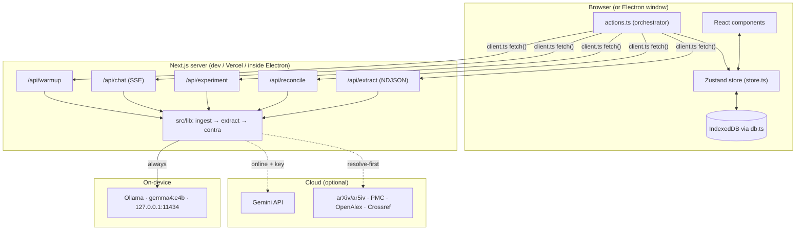
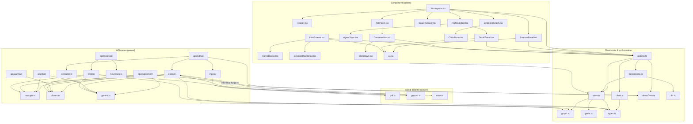

# Crux — Complete Technical Documentation

> **Crux is an evidence-to-experiment assistant**: it ingests academic papers, extracts every quantitative claim into a visual evidence graph, diagnoses *why* two papers disagree (genuine contradiction vs. context-conditioned divergence), and generates the POPPER-style falsification experiment that would settle it — with the core loop running **on-device** on Gemma 4.

This document assumes you are technically literate but know **nothing** about this project or its stack. Every technology is explained from first principles before showing how Crux uses it, and every file's interactions with every other file are mapped.

---

## Table of Contents

1. [Project Overview](#1-project-overview)
2. [The Tech Stack, From Zero](#2-the-tech-stack-from-zero)
   - [2.1 The web platform baseline](#21-the-web-platform-baseline)
   - [2.2 JavaScript & Node.js](#22-javascript--nodejs)
   - [2.3 TypeScript](#23-typescript)
   - [2.4 React](#24-react)
   - [2.5 Next.js](#25-nextjs)
   - [2.6 Tailwind CSS](#26-tailwind-css)
   - [2.7 Zustand (state management)](#27-zustand-state-management)
   - [2.8 IndexedDB & the idb library](#28-indexeddb--the-idb-library)
   - [2.9 React Flow & framer-motion](#29-react-flow--framer-motion)
   - [2.10 LLMs, Gemma, and Ollama](#210-llms-gemma-and-ollama)
   - [2.11 The Gemini REST client (and why not the SDK)](#211-the-gemini-rest-client-and-why-not-the-sdk)
   - [2.12 Parsing libraries: unpdf & node-html-parser](#212-parsing-libraries-unpdf--node-html-parser)
   - [2.13 Electron](#213-electron)
   - [2.14 tsx & the eval harness (why no jest)](#214-tsx--the-eval-harness-why-no-jest)
   - [2.15 Vercel](#215-vercel)
3. [Domain Concepts](#3-domain-concepts)
4. [Architecture](#4-architecture)
5. [How Every File Interacts](#5-how-every-file-interacts)
   - [5.1 The dependency map](#51-the-dependency-map)
   - [5.2 File-by-file: role, imports, imported-by](#52-file-by-file-role-imports-imported-by)
   - [5.3 Call flows: what happens when you click things](#53-call-flows-what-happens-when-you-click-things)
6. [Data Models / Schemas](#6-data-models--schemas)
7. [Setup & Run Instructions](#7-setup--run-instructions)
8. [API Reference](#8-api-reference)
9. [End-to-End Walkthrough](#9-end-to-end-walkthrough)
10. [Design Decisions & Trade-offs](#10-design-decisions--trade-offs)
11. [Glossary](#11-glossary)

---

## 1. Project Overview

### The problem

Scientific literature disagrees with itself constantly. Paper A reports 84.2% accuracy; Paper B reports 81.6% on "the same" benchmark. Existing tools (Elicit, Consensus, scite) tell you **that** papers disagree. None tells you **why** — and *why* is the only question that matters, because the answer decides what you do next:

- **Genuine contradiction** — same conditions, different results. A real conflict; an experiment can settle it.
- **Context-conditioned divergence** — different conditions (epochs, corpus, learning-rate schedule, protocol) explain the gap. *Both papers can be right.* No experiment needed.

Crux closes the loop: **papers in → structured claims → evidence graph → diagnosed disagreements → runnable falsification experiment out** — and the trust-critical parts run on the user's own machine.

**One-liner:** *"Every AI research tool is a pipeline — paper in, summary out. Crux is an investigator: it extracts claims on-device with Gemma 4, figures out why papers disagree, designs the experiment that settles it — and keeps working when the WiFi dies."*

### Honesty invariants (the product thesis)

1. **Numeric values are low-confidence by design** — published research (SciLead/AxCell) shows LLMs extract result numbers at only 44–69 F1, so every number is labeled "reported — verify against source."
2. **Span grounding is non-negotiable** — a claim with no verbatim source quote is deleted, unconditionally.
3. **Precision beats recall for contradictions** — a false "these papers contradict" destroys trust; the eval holds precision at 1.00 with zero false positives.

---

## 2. The Tech Stack, From Zero

Each subsection: what the technology **is**, why it **exists**, why **Crux chose it** (and over what), and **where it lives** in this repo.

### 2.1 The web platform baseline

A web app is three languages interpreted by the browser:

- **HTML** — the document structure (headings, buttons, inputs).
- **CSS** — how that structure looks (colors, spacing, layout).
- **JavaScript (JS)** — behavior: code the browser executes to react to clicks, fetch data, and rewrite the page.

Two places code can run:

- **Client (browser)** — on the user's machine. Sees the DOM, can't keep secrets (anyone can read it), can't touch the user's filesystem.
- **Server** — a machine you control (or a cloud function). Keeps secrets (API keys), does heavy work, and answers the browser over HTTP.

Crux is both: a rich client UI **plus** a small server whose only jobs are (a) holding the optional Gemini API key and (b) running the extraction/reconciliation pipeline next to Ollama. There is deliberately **no server database and no user accounts** — all user data stays in the browser (see §2.8).

### 2.2 JavaScript & Node.js

**JavaScript** is the only language browsers execute natively. It's dynamically typed (a variable can hold anything), event-driven, and single-threaded with an async model: slow operations (network calls) don't block; they resolve later via **Promises** (`await fetch(...)` = "pause this function until the network answers, let everything else keep running"). Crux's pipeline is async end-to-end — every model call, file read, and DB write is an `await`.

**Node.js** took the browser's JS engine (V8) and ran it *outside* the browser, adding file/network/process APIs — turning JS into a server language. Why it matters here: **one language for client and server** means the same type definitions, the same utility functions, and the same developer flow everywhere. Crux's server code (API routes, ingestion, extraction) is Node code; `npm` (Node's package manager) installs every dependency listed in `package.json`.

### 2.3 TypeScript

**What it is:** JavaScript plus a static type system. You annotate what shape data has —

```ts
interface Claim {
  claim_id: string;
  result_value: string;
  result_confidence: "high" | "medium" | "low";  // only these 3 strings allowed
}
```

— and the TypeScript compiler (`tsc`) checks, **before the code ever runs**, that you never violate those shapes. Misspell `claim.resultvalue`, pass a number where a string goes, forget a `null` check — build error, not a 2 a.m. runtime crash. Types are erased at build time; what ships is plain JS.

**Why it exists:** dynamic typing scales badly. In a 60-file codebase where a `Claim` flows from a server route through a stream into a store into six components, "what fields does this object have?" must be answerable by the compiler, not by memory.

**Why Crux uses it:** one file — **`src/lib/types.ts`** — defines the domain (`Claim`, `CandidateEdge`, `Reconciliation`, `ExperimentPlan`, the streaming event protocol), and because client and server are one TypeScript project, both sides are held to the identical contract. When Fix 4 added `is_own_contribution?: boolean` to `Claim`, the compiler pointed at every place that needed to care. The repo has **no unit-test framework**; `tsc --noEmit` is the first correctness gate (plus the eval harness, §2.14).

Conventions you'll see: `interface` for object shapes, union literals (`"pending" | "reconciling" | "done"`) for state machines, `?` for optional fields, generics like `extractJson<T>(raw): T` for "parse this JSON and treat it as shape T."

### 2.4 React

**What it is:** a library for building UIs out of **components** — JavaScript functions that return a description of markup (written in **JSX**, the HTML-in-JS syntax):

```tsx
function ConfidencePill({ level }: { level: Confidence }) {
  return <span className={...}>{level}</span>;
}
```

The core idea is **declarative rendering**: you never write "find the div and append a row." You write *"the UI is a function of the state"* — here is the claims array, here is what a claims list looks like — and when state changes, React re-runs the function and efficiently patches only what differs (via its virtual-DOM diff).

**Hooks** are how function components hold state and side effects:
- `useState` — local state (`const [open, setOpen] = useState(false)` — the Agent State panel's collapsed flag).
- `useEffect` — run something after render (subscribe to keyboard shortcuts in `Workspace.tsx`, fire the `/api/warmup` preload on mount in `app/layout.tsx`).
- `useCallback`/`useMemo` — cache functions/values between renders (the claim-search filter in `SourcesPanel.tsx`).

**Why Crux uses it:** the whole product is *state animating into view* — claims stream in one by one, edges flip from grey to verdict colors, progress bars fill. Declarative rendering makes that trivial: the server pushes a claim event → one array in the store grows → React re-renders the list → the new card animates in. Imperative DOM code for the same behavior would be hundreds of fragile lines.

### 2.5 Next.js

**What it is:** the dominant React *framework*. React alone renders components; Next.js adds everything around them — routing, the server, builds, and deployment shape. Crux uses **Next.js 15 with the App Router**. The pieces that matter:

- **File-based routing.** The `src/app/` directory *is* the URL map: `app/page.tsx` → `/` (the marketing landing), `app/app/page.tsx` → `/app` (the intro screen), `app/app/[id]/page.tsx` → `/app/<session-id>` (the workspace; `[id]` is a dynamic segment read via `useParams`). `layout.tsx` files wrap their subtree — `app/app/layout.tsx` renders the chat sidebar + toaster around every `/app*` page.

- **Server components vs client components.** By default App-Router components render on the server (fast first paint, no JS shipped). Anything interactive declares `"use client"` at the top of the file and runs in the browser. Crux's workspace is almost entirely client components — it's an interactive canvas app — while the landing page benefits from server rendering. Rule of thumb in this repo: *if it touches the Zustand store, it's a client component.*

- **API routes = the backend, co-located.** A file at `src/app/api/extract/route.ts` exporting `POST(req)` **is** the server endpoint `POST /api/extract`. No separate Express app, no second repo, same TypeScript types on both sides. Each of Crux's five routes declares `runtime = "nodejs"` (full Node APIs — needed for streaming and for `node:crypto`) and a `maxDuration` (extraction can take minutes).

- **Streaming responses.** Next routes can return a `ReadableStream`. `/api/extract` streams **NDJSON** (one JSON event per line) so claims appear in the UI the moment they're extracted rather than after a multi-minute batch; `/api/chat` streams raw text chunks for the typewriter effect (engine via `X-Engine` header). This is the single biggest UX reason Crux is a Next app and not a static site + separate API.

- **`output: "standalone"`** (`next.config.mjs`): the build emits a self-contained server (`.next/standalone/server.js` with its own minimal `node_modules`) — exactly what the Electron shell (§2.13) spawns to become an installable desktop app.

**Why Next over alternatives:** Vite+Express (two processes, duplicated types), Remix (fine, smaller ecosystem), plain React SPA (no server for the key/pipeline). One framework giving routed UI + streaming API + a bundleable server + first-class Vercel deploys is why this app is one repo you can `npm run dev`.

**The one gotcha this repo documents loudly:** never run `next build` while `next dev` is running — they share the `.next` cache directory and the build corrupts the dev server's chunks. Stop dev, build, restart.

### 2.6 Tailwind CSS

**What it is:** a CSS framework where you style via small utility classes in the markup — `className="flex items-center gap-2 rounded-lg border px-3 py-2"` — instead of writing separate CSS files with invented class names. A build step scans your files and emits only the utilities you actually used.

**Why it exists:** in big codebases, conventional CSS accretes — nobody dares delete a rule, naming drifts, files fight each other. Utilities keep styling local to the component and dead-code-free by construction.

**Why Crux uses it:** the visual identity is a custom **editorial dark palette** defined once as design tokens in `tailwind.config.ts` — ink `#14181C` (background), paper `#EDE6D6` (text), rust `#C1440E` (contradiction), sage `#6B8F71` (agreement), gold `#C9A227` (divergence/accent) — plus three font stacks (serif display, Inter body, JetBrains Mono for structured data). Every component speaks in those tokens (`text-paper-dim`, `border-ink-500`, `bg-gold/10`), so the design language stays coherent across 20+ components with zero standalone stylesheets except `globals.css` (base theme, scrollbars, React Flow skin, animations). Responsive behavior is utility-prefixed: `py-3 lg:py-2` = 44px touch target on phones, compact from the `lg` breakpoint (1024px) up.

### 2.7 Zustand (state management)

**The problem it solves:** React state (`useState`) lives inside one component. But Crux's claims/edges/phase must be read by the sources panel, the graph, the right sidebar, the agent-state panel, and the header simultaneously — and *written* by non-React code (the streaming consumer). Threading it through props ("prop drilling") or React Context re-renders half the app on every claim.

**What Zustand is:** a tiny store library. You create one store holding state + updater functions:

```ts
const useStore = create<State>((set, get) => ({
  claims: [],
  addClaim: (c) => set((s) => ({ claims: [...s.claims, c] })),
}));
```

Components subscribe to *slices* — `const claims = useStore((s) => s.claims)` — and re-render only when their slice changes. Crucially, **non-React code can call `useStore.getState()`**: that's how `src/lib/actions.ts` (plain async functions, not components) drives the entire pipeline into the store.

**Why Zustand over Redux/Context:** Redux's ceremony (actions, reducers, dispatch) buys audit trails Crux doesn't need; Context isn't a state manager (no selective subscription). Zustand is ~1KB and matches the architecture: **`src/lib/store.ts` is the single source of truth; components stay thin; `actions.ts` orchestrates.**

### 2.8 IndexedDB & the idb library

**What it is:** the browser's built-in database — asynchronous, transactional, structured object stores with indexes, hundreds of MB of capacity. Contrast `localStorage`: synchronous (blocks the UI), strings-only, ~5MB. IndexedDB's native API is famously awkward (event-based callbacks), so Crux uses **`idb`**, a thin promise wrapper.

**Why Crux persists here and not a server DB:** local-first is the product. "Your unpublished draft never leaves the laptop" must include the *derived* data (claims, verdicts, experiments, chats). A server DB would also mean accounts, auth, and infrastructure — all noise for a single-user research tool.

**How it's used:** `src/lib/db.ts` defines the `crux` database with four object stores — `sessions` (each session's full papers/claims/edges snapshot), `chats`, `workflows` (step log), `experiments` — indexed by session. `src/lib/persistence.ts` layers policy on top: **debounced 500ms** writes after every pipeline step (so streaming 30 claims doesn't hammer the disk), quota-error handling that degrades to a toast + memory-only operation (never a crash), and `hydrateSessionById` which rebuilds the store from disk when you open `/app/<id>` — that's why a hard refresh loses nothing. UI-only preferences (sidebar collapsed, active tab) live separately in `localStorage` via `src/lib/prefs.ts` — trivial, synchronous-read-at-boot data that doesn't belong in the DB.

### 2.9 React Flow & framer-motion

**React Flow (`@xyflow/react`)** is a node-and-edge canvas library: pannable, pinch-zoomable, with custom node renderers. The alternative is a raw SVG/D3 force graph — weeks of interaction code. Crux registers one custom node type (`ClaimNode.tsx`, a claim card) and feeds `EvidenceGraph.tsx` nodes (claims, laid out in per-paper columns) and edges (candidate pairs) whose stroke color and animation encode status: grey pending → animated dashes while reconciling → rust/gold/sage on verdict (the transition lives in `globals.css`). Node/edge clicks write the selection into the store; the right sidebar reacts.

**framer-motion** is a declarative animation library (`<motion.div initial={{opacity:0,y:18}} animate={{opacity:1,y:0}}>`). Used for purposeful motion only: claims fading up as they stream, drawer slide-ins, the landing page's parallax floating blocks. The design rule (from `CLAUDE.md`): motion signals pipeline progress, never decoration for its own sake.

### 2.10 LLMs, Gemma, and Ollama

**An LLM** (large language model) is a neural network trained to predict the next token of text; at scale that yields general abilities — summarize, extract structure, reason over a prompt. Two properties shape Crux's whole design: LLMs **hallucinate** (they produce plausible text, not verified text — hence the grounding gate, §3), and they **come in sizes** (a 4-billion-parameter model runs on a laptop; frontier models need datacenters).

**Gemma** is Google's family of *open-weight* models — you can download and run them yourself, unlike API-only Gemini. Crux runs **Gemma 4 E4B** (edge-tuned, ~4B class; the smaller E2B also works via one env var).

**Ollama** is a local model runtime: it downloads models, manages memory, and serves an HTTP API on `127.0.0.1:11434`. Crux talks to it with plain `fetch` — `POST /api/generate {model, prompt, format:"json", keep_alive, options:{num_ctx, num_predict}}`. Everything about the local connection is centralized in **`src/lib/ollama.ts`**: host/model config, reachability probe (2.5s timeout on `/api/tags` — this is also how "is the user running Ollama?" is auto-detected), warmth inspection (`/api/ps`), and the pre-warmer. The hard-won rule encoded there: **`keep_alive` is per-request** — Ollama evicts idle models after ~5 minutes, and a single call site omitting `keep_alive:-1` re-arms eviction, which once produced 17-minute extraction spikes (a 9.5GB model reloading mid-batch). One config module, imported by every call site, killed that bug class. Also: the sentinel must be the *number* `-1`; Ollama rejects the string `"-1"`.

**Model tiering** — who does what:

| Tier | Model | Job | Where |
|---|---|---|---|
| Extraction | `gemma4:e4b` (Ollama) | claims from chunks | on-device, always first |
| Extraction escalation | `gemma-4-31b-it` → Gemini Flash | starved chunks only | cloud, when online + key |
| Reconcile + Experiment | Gemini 3 Flash, **or** local Gemma in Local Mode (`RECONCILE_BACKEND=local`) | verdicts, POPPER plans | cloud by default, on-device on demand |
| Chat | `gemini-flash-latest` | grounded Q&A | cloud only |

The design sentence: **small Gemma on-device is the always-works floor; hosted Gemma/Gemini are the connectivity-optional ceiling.** Every verdict/plan carries an `engine` field naming its actual producer, rendered as a badge — provenance is never faked.

### 2.11 The Gemini REST client (and why not the SDK)

Google ships an official SDK, and Crux deliberately doesn't use it. **`src/lib/gemini.ts`** is a ~250-line hand-rolled REST client because the free tier forced behaviors the SDK doesn't expose cleanly:

- **Model fallback chains.** Free-tier quota throttling returns *empty 200s* and preview models intermittently 404/overload. `generate(chain, prompt)` walks an ordered list of model IDs, classifying each failure (quota / not-found / transient) and falling to the next. The `MODELS` table defines a chain per tier, every entry env-overridable.
- **SSE streaming** parsed by hand for chat token deltas.
- **`extractJson<T>`** — small models wrap JSON in prose/fences; this salvages the object.
- `hasKey()` — the one function everything checks to decide cloud vs local vs demo behavior.

### 2.12 Parsing libraries: unpdf & node-html-parser

**The ingestion insight:** PDF text extraction is *structurally* bad — PDFs store positioned glyphs, not reading order, so tables (where headline numbers live) come out garbled. Crux therefore **resolves first**: identify the paper (`ingest/identify.ts` regexes arXiv IDs/DOIs from the first two pages) and fetch *clean structured text* from scholarly sources (`ingest/sources.ts`: arXiv native HTML → **ar5iv** (arXiv's LaTeX→HTML renderer) → API abstract; PMC JATS / OpenAlex / Crossref for DOIs). **node-html-parser** (a fast, dependency-light HTML parser for Node) turns that HTML into `{heading, text}` sections. Only when nothing resolves does **unpdf** (a serverless-friendly pdf.js build, registered in `serverExternalPackages`) parse the raw PDF, marked `fidelity: "low"`. `ingest/clean.ts` then scrubs ar5iv artifacts (LaTeX macro residue like `6.7%percent6.76.7\%`, `[41]` citation markers, zero-width characters) **before chunking**, so extraction input and the grounding gate see identical clean text.

### 2.13 Electron

**What it is:** a desktop-app shell = a bundled Chromium (renders your web UI) + a bundled Node.js (the **main process**, with OS access). Your web app becomes an installable app without rewriting anything.

**Crux's twist:** the app needs its *server* (API routes + pipeline), not just static files. So `electron/main.js` **spawns the Next standalone server** (§2.5) as a child process on port 34117 — using `ELECTRON_RUN_AS_NODE=1`, which makes the Electron binary act as plain Node, so users don't need Node installed — waits for the port, then opens a `BrowserWindow` at it. Security defaults on (`contextIsolation`, no `nodeIntegration`; `preload.js` is intentionally empty); external links open in the system browser. The packaged app defaults to `RECONCILE_BACKEND=local`, ships **no API key** (a user can add one via `~/Library/Application Support/Crux/crux.env`), and is built by **electron-builder** into `dist-electron/Crux-<v>-arm64.dmg` via `npm run electron:build`. Two packaging landmines already handled: electron-builder silently excludes dot-directories, so the build stages `.next/standalone` → `desktop-server/`; and native-module rebuilding is disabled (`npmRebuild:false`) since the standalone server carries its own pure-JS deps.

### 2.14 tsx & the eval harness (why no jest)

**tsx** runs a TypeScript file directly (`npx tsx eval/run.ts`) — no build step. The repo has **no jest/vitest** by choice: the failure modes that matter here aren't unit-level ("does this function return 4") but *pipeline-level* ("does extraction still ground every span? does the contradiction detector still have zero false positives?"). So verification is the **`/eval` harness** (excluded from the Next build via `tsconfig.json`): a frozen paper corpus, hand-verified gold labels, deterministic metrics (`eval/metrics.ts` — span-grounding rate is the primary, label-free metric), a contradiction-precision suite, and a battery of deterministic `*-check.ts` regression scripts (miner behavior, scaling-law pairing, local-mode network isolation — one script literally blocks all non-localhost `fetch` to simulate dead WiFi — keep-alive serialization, retry logic). `ENGINEERING_LOG.md` records baseline-vs-current for every change. That's the testing philosophy: **measure the invariants you sell.**

### 2.15 Vercel

**What it is:** the deployment platform built by the Next.js team — push a repo, it builds and serves it; API routes become serverless functions (spun up per request, capped duration).

**How Crux uses it:** the public preview at `crux-two-phi.vercel.app`. In the cloud there is **no Ollama**, so the reachability probe fails fast and everything honestly degrades: extraction uses hosted models, the warmth pill hides itself, badges say hosted, and the pre-baked demo works keyless. `RECONCILE_BACKEND=local` is deliberately **not** set there. Serverless caps (~60s on the free tier) make the instant demo corpus the intended web path; the full local-first experience is the laptop/Electron build — same repo.

---

## 3. Domain Concepts

*(Brief — these are Crux-specific ideas the code implements; the file map in §5 shows where.)*

- **Claim** — one atomic extracted assertion: `(task, dataset, metric, result_value, conditions, provenance_span)`.
- **Span grounding** — every claim's `provenance_span` must appear **verbatim** in the source chunk (whitespace-normalized substring + distinctive-token fallback, `extract/ground.ts`) or the claim is deleted; numbers absent from the source are stripped. Hallucinated claims are structurally impossible — the SAFE/FActScore standard.
- **Canonicalization** — folding naming variants so claims become comparable: `ILSVRC-2014`→`imagenet`, "top-5 test error"→`top5 error`, tasks bucketed (`graph.ts`).
- **Scaling role** — scaling-law claims (Kaplan's *N_opt ∝ C^a, a=0.73* vs Chinchilla's *a=0.50*) have no benchmark dataset; their identity is the coefficient's role (param-exponent vs data-exponent), detected only with power-law-over-compute context, letting them pair across different training corpora.
- **Candidate edge** — a cross-paper pair of comparable claims, awaiting a verdict. Third-party claims (a paper *citing* a competitor's number, `is_own_contribution:false`) are shown as context but never edge.
- **The precision cascade** — verdicts come from: (1) a deterministic **hard guard** (different metric/dataset can never contradict — no model call), (2) a strict **Likert adjudicator** whose rubric asks *"does the differing condition explain a gap this large?"* (genuine requires reason + score ≥ 8/10), (3) a **low-confidence-number guard** (two low-confidence values can't assert a contradiction; borderline → `needs_human_review` → explicit human handoff).
- **The deterministic miner** (`extract/mine.ts`) — regex safety net over *every* section for headline results ("7.3% top-5 error", `pN=0.73`, "we find that a=0.50 and b=0.50"); own-result sentences only (citation/comparison sentences refused); span-grounded by construction. Why extraction can never starve to zero again.
- **POPPER-style experiment** — a falsification plan for genuine contradictions: H₀/H₁ with thresholds, variables held fixed, the single discriminating manipulation, a decision rule, cost estimate.
- **Agent loop** — sense (grounded extraction) → decide (guards, escalation, the NEXT queue) → act (reconcile, experiment) → check (gates, thresholds, local retry with expanded boundary) — surfaced live in the Agent State panel, with `needs_human_review` as the human-handoff boundary.

---

## 4. Architecture



**The five-stage pipeline:** Ingest (resolve-first clean text) → Extract (Gemma chunks + miner → grounding gate) → Graph (canonicalize → candidate edges) → Reconcile (precision cascade → verdict) → Experiment (POPPER plan). The **server is stateless** — all session state lives in the browser; the client orchestrates the pipeline step by step. The **demo path** ("Load demo corpus") streams a curated corpus with pre-baked verdicts entirely client-decided — instant, deterministic, honest about being a demo — while "Verify live" and uploads exercise the real pipeline.

---

## 5. How Every File Interacts

### 5.1 The dependency map

Arrows mean "imports from". Read bottom-up: `types.ts` is imported by nearly everything; `gemini.ts`/`ollama.ts` are leaf infrastructure.



Three structural facts worth noticing:

1. **`types.ts` is the spine.** Client store, server routes, and pipeline all import the same shapes — the compiler enforces the contract across the network boundary.
2. **`graph.ts` is imported from both worlds** — the server (extraction dedup uses the canonicalizers; contra uses `scalingRole`) and the client (the store builds candidate edges). It therefore contains only pure functions with no Node/browser-specific APIs.
3. **One deliberate cycle:** `extract/mine.ts` imports inference helpers (`inferMetric`/`inferTask`/`inferDataset`) from `extract/index.ts`, which imports `mineResults`/`mineScalingExponents` back. It resolves because each side only *calls* the other's functions at runtime, after both modules load.

### 5.2 File-by-file: role, imports, imported-by

#### The shared foundation

| File | Role | Imports (internal) | Imported by |
|---|---|---|---|
| `lib/types.ts` | Every domain shape + the NDJSON event protocol | — | store, actions, client, graph, db, prompts, extract/*, contra, ingest callers, most components, all routes |
| `lib/theme.ts` | Verdict/confidence display metadata (colors, labels), paper tints | types | EvidenceGraph, DetailPanel, SourcesPanel, ui |
| `lib/prompts.ts` | **Every LLM prompt**: chunk extraction (flat schema + provenance span), adjudication rubric, POPPER experiment, chat system+user | types | extract/index, extractor, contra, api/experiment, api/chat |

#### Infrastructure (leaf modules)

| File | Role | Imports | Imported by |
|---|---|---|---|
| `lib/gemini.ts` | Cloud REST client: `generate`/`generateStream` over fallback chains, `extractJson`, `hasKey`, `MODELS` tier table | — | extract/index, extractor, contra, api/extract, api/experiment, api/chat |
| `lib/ollama.ts` | Single source of truth for the local tier: host/model/`keep_alive` (numeric coercion), `ollamaReachable`, `warmOllama`, `ollamaWarmth` | — | extract/index, extractor, contra, api/experiment, api/warmup |
| `lib/pdf.ts` | unpdf fallback parser (`parsePdf`, `priorityText`) | — | ingest/index, eval/run |
| `lib/toast.ts` | Tiny pub-sub for toast notifications | — | persistence, Header, Toaster, [id]/page |

#### Ingestion (server)

| File | Role | Imports | Imported by |
|---|---|---|---|
| `ingest/identify.ts` | Regex arXiv-ID/DOI out of first-page text | — | ingest/index |
| `ingest/sources.ts` | Fetch structured text: arXiv HTML → ar5iv → abstract; PMC/OpenAlex/Crossref. Returns `StructuredDoc` | ingest/html | ingest/index, eval/fetch-scaling-texts |
| `ingest/html.ts` | node-html-parser helpers (HTML → sections) | — | sources |
| `ingest/clean.ts` | `cleanText`/`cleanDoc`: LaTeX-artifact collapse, citation-marker strip, zero-width-char removal — **before chunking** | sources (type) | ingest/index, eval fixtures |
| `ingest/index.ts` | `ingest()` resolve-first orchestration + in-process cache; `extractionInput()` | pdf, identify, clean, sources | api/extract, eval |

#### Extraction (server)

| File | Role | Imports | Imported by |
|---|---|---|---|
| `extract/ground.ts` | The grounding gate: `isGrounded`, `valueInSource`, `numericCore` | — | extract/index, contra (numericCore) |
| `extract/mine.ts` | Deterministic miner: benchmark + scaling-exponent patterns, own-sentence gating, cite-refusal | types, extract/index (inference helpers) | extract/index, eval checks |
| `extract/index.ts` | **The cascade**: cache → chunking (offsets kept) → Gemma per chunk → gate → local retry (expanded boundary) → cloud escalation → miner sweep → ownership fix → coefficient split → canonical dedup. Exports `extractClaims`, `warmOllama` re-export, inference helpers, stats | gemini, prompts, ground, mine, graph, ollama, types | api/extract, eval |
| `lib/extractor.ts` | Legacy v1 one-shot extractor (kept for the "Verify live" demo path) | gemini, prompts, ollama, types | api/extract, eval |

#### Graph & adjudication (shared / server)

| File | Role | Imports | Imported by |
|---|---|---|---|
| `lib/graph.ts` | Pure functions: `canonDataset/Metric/Task`, `scalingRole`, `groupKey`, `buildCandidateEdges` (skips third-party/value-less), `splitCompoundCoefficients` (idempotent) | types | store (client!), actions, extract/index, contra, eval |
| `contra/index.ts` | `hardGuard` + `adjudicate` precision cascade; Local-Mode branch; engine labeling | graph, gemini, prompts, ground, ollama, types | api/reconcile, eval/contra |
| `lib/heuristics.ts` | No-model last-resort reconciliation | types | api/reconcile |

#### Client state & orchestration

| File | Role | Imports | Imported by |
|---|---|---|---|
| `lib/store.ts` | **Single source of truth**: papers/claims/edges/experiments/chat/phase/selection/progress/sidebars/session. Entry points `finalizeExtraction` & `hydrateSession` both split coefficients + rebuild edges | zustand, types, graph, prefs, db (types) | every interactive component, actions, persistence, [id]/page |
| `lib/actions.ts` | Orchestrators: `runExtraction` (consumes NDJSON → store), `runReconciliation` (sequential edges; demo verdicts or live; attaches engine), `runExperiment` (cached per edge), `sendChat` (SSE), `runJudgeMode`, `runLiveDemo` | store, client, graph, demoData, persistence, toast | SourcesPanel, DetailPanel, Conversation, Workspace, IntroScreen, [id]/page |
| `lib/client.ts` | Typed fetch wrappers: `streamExtract` (NDJSON reader), `reconcile`, `generateExperiment`, `askChatStream` (SSE reader) | types | actions |
| `lib/db.ts` | idb schema (`sessions/chats/workflows/experiments`) + CRUD | idb, types | persistence, AppSidebar, IntroScreen, Header (clearAll), landing |
| `lib/persistence.ts` | Debounced session save, step log, experiment/chat persist, `hydrateSessionById` | db, store, toast | actions, [id]/page, AppSidebar |
| `lib/prefs.ts` | localStorage UI prefs | — | store, app/layout |
| `lib/demoData.ts` | Curated corpus + pre-baked reconciliations/experiments + paper bodies | types | api/extract, api/experiment, actions |
| `lib/useTypewriter.ts` | Token-reveal hook for streaming text | — | SourcesPanel (ClaimRow) |

#### Pages & routes

| File | Role | Key interactions |
|---|---|---|
| `app/layout.tsx` | Root: fonts, metadata, viewport (`viewportFit:cover` for safe areas) | wraps everything |
| `app/page.tsx` | Marketing landing | → HomeBlocks, landing/*, db (pre-warm), router → `/app` |
| `app/app/layout.tsx` | App shell | AppSidebar + children + Toaster; `applyPrefs`; fires `/api/warmup` POST on mount |
| `app/app/page.tsx` | `/app` | renders IntroScreen |
| `app/app/[id]/page.tsx` | `/app/:id` | `hydrateSessionById` → store; missing → toast + redirect; `?run=demo\|live` triggers actions; renders Workspace |
| `api/extract/route.ts` | Streaming extraction | demo → demoData; live → warmOllama → ingest → extractClaims (progress/status callbacks → NDJSON lines) |
| `api/reconcile/route.ts` | One verdict | `toAdjClaim` → `adjudicate` → heuristic fallback |
| `api/experiment/route.ts` | One plan | Local Mode → ollamaExperiment → template; else Gemini → local → demo → template |
| `api/chat/route.ts` | SSE chat | prompts + `generateStream` over the chat chain |
| `api/warmup/route.ts` | GET warmth / POST preload | ollama.ts only |

#### Components (all client)

| File | Reads from store | Calls | Notes |
|---|---|---|---|
| `Workspace.tsx` | phase, judgeMode, sidebar states | `runJudgeMode` | 3-panel grid + collapse transitions; keyboard map (⌘[ ⌘. / Esc); mobile drawers + scrim + FABs; hosts `SourcesRail` |
| `Header.tsx` | phase, judgeMode, sessionName | reset, setJudgeMode, router | Stack pill popover; ⋯ overflow menu (New chat/Judge/Reset/shortcuts/clear-data via db.clearAll) |
| `SourcesPanel.tsx` | papers, claims, phase, status, progress, search | `runExtraction`, `runReconciliation`, `runLiveDemo`, selectClaim | upload/demo actions; WarmthIndicator pill; typewriter claim rows; `cited`/`pattern-grounded` badges |
| `EvidenceGraph.tsx` | claims, edges, selection | selectClaim, selectEdge | builds React Flow nodes/edges; verdict colors from theme; mobile fit tuning |
| `ClaimNode.tsx` | (props) | — | claim card node renderer |
| `RightSidebar.tsx` | activeTab, collapsed, edges | setActiveTab, setCollapsed | tabs + rail; mounts AgentState above both tabs |
| `AgentState.tsx` | question, phase, status, progress, edges, claims, experiments, source | — | derives GOAL/STATE/PROGRESS/CONFIDENCE(trend)/NEXT/HANDOFF; minimized-by-default |
| `DetailPanel.tsx` | selection, edges, claims, experiments | `runExperiment`, openSource, selectEdge | overview tiles → strongest edge; claim provenance card; verdict card + EngineBadge + reasoning trace + plan |
| `SourceViewer.tsx` | openSource target, papers | closeSource | span-highlight modal; bottom sheet on mobile |
| `AskPanel.tsx` / `Conversation.tsx` | chat, pending, streaming | `sendChat`, setChatExpanded | tab + fullscreen overlay; claim-reference pills select nodes |
| `AppSidebar.tsx` | navOpen (prefs) | db.listSessions/rename/delete, router | rail (hidden on mobile) + drawer; ⌘B |
| `IntroScreen.tsx` | sessions (db), question | startSession, `runExtraction`+`runReconciliation` (upload), router | hypothesis composer (the GOAL), chips, resume cards |
| `Toaster.tsx` | — | toast subscribe | fixed, safe-area aware |
| `ui.tsx` | — | — | VerdictBadge, ConfidencePill/Bar, HandleChip, HumanReviewFlag, WarmthIndicator (polls `/api/warmup`), SectionLabel |

### 5.3 Call flows: what happens when you click things

**A. App opens (`/app`)**
`app/app/layout.tsx` mounts → `applyPrefs(loadPrefs())` (store ← localStorage) → fire-and-forget `fetch POST /api/warmup` → `api/warmup` → `ollama.warmOllama()` loads gemma4:e4b with `keep_alive:-1` → meanwhile `IntroScreen` → `db.listSessions()` → resume cards render. `ui.WarmthIndicator` begins polling GET `/api/warmup` → "Gemma 4 · warm ✓ · 0.3s".

**B. You type a hypothesis and hit ↵**
`IntroScreen.submitQuestion` → `store.startSession({question})` (question = the Agent State GOAL) → `router.push("/app/<id>")` → `[id]/page.tsx` sees the store already holds the session (skips hydration) → renders `Workspace`.

**C. "Load demo corpus"**
`SourcesPanel.loadDemo` → `actions.runExtraction({demo:true})` → `client.streamExtract` POSTs FormData `demo=1` → `api/extract` streams `demoData` papers/claims as NDJSON with pacing → each line: actions dispatches `store.addPaper/addClaim/setStatus` → UI animates → `done` → `store.finalizeExtraction` (→ `graph.splitCompoundCoefficients` + `graph.buildCandidateEdges`) → `actions.runReconciliation` → demo source detected → pre-baked `DEMO_RECONCILIATIONS[edge_id]` per edge with animation beats → `persistence.persistCurrentSession()` (debounced → `db.saveSession`).

**D. You drop two real PDFs**
`SourcesPanel.handleFiles` → `runExtraction({files})` → POST `/api/extract` with files → route: `warmOllama()` (streams load status) → per file: `ingest()` (identify → sources → cleanDoc; PDF fallback only if unresolved) → `extractClaims(sections, {onProgress, onStatus})` → per chunk: `prompts.chunkExtractionPrompt` → `ollamaExtract` → `ground.groundChunk` (gate + slot inference) → zero-claims? local **retry** with `expandChunk` (streamed "Retrying chunk 2/6…") → still zero + online? `geminiExtract` escalation → after chunks: `mine.mineResults` + `mineScalingExponents` over *all* sections → `reconcileOwnership` → `splitCompoundCoefficients` → `dedup` → claims streamed throughout as NDJSON → client: same store path as C → `finalizeExtraction` → edges appear grey.

**E. Reconciliation runs (live)**
`runReconciliation` walks `store.edges` sequentially: `setEdgeReconciling` (edge animates dashes) → `client.reconcile(a,b)` → `api/reconcile` → `contra.adjudicate`: Local Mode? → `ollamaAdj` directly; else `hasKey()` → `geminiAdj`, catch → `ollamaAdj`, none → route falls to `heuristics.heuristicReconcile` — hard guard may answer with no model at all → response `{reconciliation, engine…}` → actions attaches `engine` → `store.setReconciliation` (edge colors by verdict; AgentState CONFIDENCE/NEXT update) → `persistCurrentSession()` after each pair.

**F. "Generate experiment to resolve"**
`DetailPanel` button → `actions.runExperiment(edgeId)` (returns cached `store.experiments[edgeId]` if present; demo source → `DEMO_EXPERIMENTS` with a beat) → `client.generateExperiment(a, b, reasoning, edgeId)` → `api/experiment`: Local Mode → `ollamaExperiment` (90s cap, field validation) → else Gemini chain → fallbacks → `{plan, engine}` → `store.setExperiment` → `ExperimentCard` renders with `EngineBadge("generated on-device · gemma4:e4b")` → `persistence.persistExperiment`.

**G. You ask a question in the Ask tab**
`Conversation` → `actions.sendChat(q)` → serializes the evidence graph into a context string → `client.askChatStream` → `api/chat` → `prompts.chatSystemPrompt/chatPrompt` → `gemini.generateStream` → SSE tokens → store streaming buffer (typewriter) → final turn stored + `persistChatTurn` → claim-reference pills in the answer select graph nodes on tap.

**H. You refresh `/app/<id>` (or reopen tomorrow)**
`[id]/page.tsx` → `persistence.hydrateSessionById(id)` → `db.getSession/getChats/getExperiments` → `store.hydrateSession` (splits any pre-fix compound claims, restores edges/verdicts/phase) → Workspace renders exactly where you left off. Unknown id → toast "Session not found" → redirect `/app`.

**I. WiFi dies mid-session**
Extraction: Ollama is localhost — unaffected. Reconcile/experiment in Local Mode: unaffected (the fetch-guard eval proves only `127.0.0.1` is touched). With a key but no Local Mode: Gemini call fails → caught → local Gemma fallback (engine badge says so). New-PDF ingestion: resolve-first fetches fail → raw PDF parse fallback (lower fidelity). Chat: fails — cloud-only, scoped out of the offline story.

---

## 6. Data Models / Schemas

All in `src/lib/types.ts` unless noted.

```ts
interface Claim {
  claim_id: string;            // "claim-<8 hex>"
  paper_id: string;
  claim_text: string;          // one-sentence result statement
  task: string;                // may be inferred from grounded text
  dataset: string;             // inferred only from names literally present
  metric: string;              // "top-5 error" | "param scaling exponent a (N_opt ∝ C^a)" …
  result_value: string;        // verbatim; "" if not grounded in source
  result_confidence: "high" | "medium" | "low";   // numbers cap at medium by design
  conditions: { train_test_split: string|null; sample_size: string|null;
                hyperparameters: string|null; preprocessing: string|null; other: string|null };
  source_span: { page: number; text: string };    // the verbatim provenance quote
  extractor?: "gemma-on-device" | "gemma-hosted" | "gemini-escalated" | "demo";
  grounded?: boolean;          // passed the span gate
  mined?: boolean;             // produced by the deterministic miner
  about_system?: string;       // whose result ("VGG", "GoogLeNet"…)
  is_own_contribution?: boolean; // false ⇒ cited third-party ⇒ never edges
}

interface CandidateEdge {
  edge_id: string; source_claim_id: string; target_claim_id: string;
  task: string; dataset: string; metric: string;
  reconciliation?: Reconciliation;
  status: "pending" | "reconciling" | "done";
}

interface Reconciliation {
  verdict: "GENUINE_CONTRADICTION" | "CONTEXT_CONDITIONED_DIVERGENCE" | "AGREEMENT";
  confidence: number;              // 0..1
  reasoning: string;               // the visible trace
  differing_conditions: string[]; shared_conditions: string[];
  needs_human_review?: boolean;    // the handoff flag
  engine?: string;                 // "gemini" | "gemma:<model>" | "guard" | "heuristic" | "demo"
}

interface ExperimentPlan {
  edge_id: string; title: string;
  hypothesis_null: string; hypothesis_alternative: string;
  variables_held_fixed: string[]; manipulation: string;
  discriminating_metric: string;   // metric + decision rule
  expected_outcome_if_paper_a_correct: string;
  expected_outcome_if_paper_b_correct: string;
  estimated_conclusiveness: "high" | "medium" | "low";
  estimated_compute_cost: string;
  engine?: string;                 // "gemma:<model>" | Gemini id | "template" | "demo"
}

type ExtractEvent =                // server → client NDJSON protocol
  | { type: "paper"; paper: Paper }
  | { type: "status"; message: string }
  | { type: "progress"; done: number; total: number; heading: string; paper_id: string; ms?: number }
  | { type: "claim"; claim: Claim }
  | { type: "done"; papers: Paper[]; claims: Claim[]; source: ExtractSource }
  | { type: "error"; message: string };
```

**IndexedDB** (`db.ts`, database `crux`): `sessions` (id → name, question, source, `papers[]`, `claims[]`, `edges[]`, timestamps) · `chats` (turn_id, indexed by session) · `workflows` (step log) · `experiments` (indexed by session). Writes debounced 500ms; quota errors → toast, memory-only degradation. `localStorage["crux:prefs"]`: sidebar states + active tab only.

---

## 7. Setup & Run Instructions

**Prerequisites:** Node.js 20+, npm; **Ollama** (`ollama pull gemma4:e4b` — or `e2b` for low-RAM) for the on-device tier; optional Google AI Studio key for cloud tiers.

**`.env.local`** (copy `.env.example`):

```bash
GEMINI_API_KEY=                      # optional — demo + Local Mode work without it
GEMMA_MODEL=gemma-4-31b-it           # hosted escalation tier
GEMINI_RECONCILE_MODEL=gemini-3-flash-preview
GEMINI_EXPERIMENT_MODEL=gemini-3-flash-preview
GEMINI_CHAT_MODEL=gemini-flash-latest
# OLLAMA_HOST=http://127.0.0.1:11434 # auto-probed even when unset
# OLLAMA_GEMMA_MODEL=gemma4:e4b
# OLLAMA_KEEP_ALIVE=-1               # keep model resident (numeric sentinel)
# OLLAMA_CHUNK_TIMEOUT_MS=60000
# EXTRACT_MAX_CHUNKS=3               # demo-day latency lever
# RECONCILE_BACKEND=local            # full on-device loop (WiFi-off capable)
```

```bash
npm install
npm run dev                          # http://localhost:3000 · /app is the tool
npm run build && npm run start       # production (NEVER build while dev runs — shared .next cache)
npm run eval / npm run eval:contra   # the verification harness
npx tsx eval/scaling-e2e.ts          # …and the deterministic check suites
npm run electron:dev                 # desktop window on the dev server
npm run electron:build               # → dist-electron/Crux-<v>-arm64.dmg (unsigned: right-click→Open)
```

**Vercel:** import repo, set `GEMINI_API_KEY` (+ model vars). Do **not** set `RECONCILE_BACKEND=local` in the cloud — there's no Ollama there.

---

## 8. API Reference

All routes `runtime="nodejs"`, no auth (local-first, single-user).

| Route | Request | Response |
|---|---|---|
| `POST /api/extract` | `multipart/form-data`: `demo=1` (curated) \| `demo=live` (demo papers through real models) \| `files` (PDFs) | `application/x-ndjson` stream of `ExtractEvent` lines; live path warms Ollama, streams per-chunk `progress` + recovery `status` beats |
| `POST /api/reconcile` | `{ a: Claim, b: Claim }` | `{ reconciliation, engine, reason, likert, comparable }`; guard verdicts return instantly (`engine:"guard"`); heuristic fallback when no engine |
| `POST /api/experiment` | `{ a, b, reasoning, edgeId }` | `{ plan: ExperimentPlan, engine }` — `gemma:<model>` \| Gemini id \| `template` \| `demo` |
| `POST /api/chat` | `{ question, papers, claims, edges }` — the server serializes the graph context itself | Plain-text token stream (chunked body, not SSE-framed); producing engine in the `X-Engine` response header |
| `GET /api/warmup` | — | `{ reachable, warm, model?, sizeVramMb? }` (no model load) |
| `POST /api/warmup` | — | same + `{ ready, loadMs }` after preloading at extraction context size |

---

## 9. End-to-End Walkthrough

*User drops `kaplan.pdf` + `chinchilla.pdf` and asks "Do the scaling-law papers actually contradict each other?"*

1. **Composer** → `startSession({question})` → GOAL set → `/app/<id>`.
2. **Upload** → NDJSON stream begins; Ollama pre-warmed (`keep_alive:-1`, load time streamed).
3. **Ingest** → `arXiv:2001.08361` identified → ar5iv structured HTML (55 clean sections) → `cleanDoc` strips LaTeX junk + zero-width chars. No raw PDF parsing.
4. **Extract** → Gemma per priority chunk (`Extracting · chunk 2/3 · Results · 41s`); a starved chunk retries once with expanded boundary (streamed); the **miner** sweeps all sections and deterministically catches `pN=0.73`/`pD=0.27` regardless of model mood; every claim passes the grounding gate and animates in.
5. **Post-passes** → Chinchilla's compound *"a is 0.50 and b is 0.50"* splits into per-coefficient claims; its cited-Kaplan row flagged `cited` (never edges); dedup collapses twins.
6. **Graph** → `scalingRole` pairs param-exponents (0.73 ↔ 0.50/0.49/0.46) and data-exponents (0.27 ↔ 0.50/0.51/0.54) across papers → grey edges.
7. **Reconcile** (Local Mode) → on-device adjudication ~19s/pair → gold divergence verdicts (the LR-schedule condition explains the gap) with `engine: gemma:gemma4:e4b` badges; Agent State: PROGRESS 8/8, CONFIDENCE mean + trend, NEXT → design experiment.
8. **Experiment** → on-device POPPER plan ~22s: *"Impact of LR Scheduling Strategy on Parameter Scaling Exponent (a)"* — H₀/H₁, held-fixed variables, retraining sweep, CI decision rule. Badge: *generated on-device*.
9. **Handoff** → one low-confidence pair sets `needs_human_review` → "1 pair needs your judgment" → the human opens `SourceViewer` and checks the highlighted span.
10. **Persist** → everything debounce-saved; refresh rehydrates; pull the WiFi and steps 7–8 still work.

---

## 10. Design Decisions & Trade-offs

- **Local-first / small Gemma, not a bigger model:** privacy is the hook; free-tier quota starvation was the forcing function; bigger local models worsen the real edge constraints (cold start, VRAM). E4B is the floor; hosted tiers are the ceiling, not a dependency.
- **Deterministic layers wrap every model call:** grounding gate, hard guard, miner, canonicalizers, template fallback — models propose, deterministic code disposes. Trust-critical behavior never depends on model mood.
- **Exact-key retrieval instead of embeddings:** auditable, free, can't hallucinate a pairing; recall on unseen paraphrases is the accepted cost (embedding→cross-encoder retrieval is the documented v2).
- **Stateless server, client orchestration:** identical deploys on dev/Vercel/Electron; no accounts; the cost is no cross-device sync.
- **The keep-alive lesson:** per-request config controlling shared state (Ollama model residency) must have exactly one source of truth — one missed call site caused 17-minute extraction spikes.
- **Known limitations:** numeric extraction capped at "medium" confidence on purpose (span viewer is the verification loop); contradiction recall sacrificed for precision (1.00 precision / 0.67 recall on the labeled set); local e4b is slow (~40–90s/chunk) and per-run nondeterministic (the miner compensates); chat is cloud-only; miner patterns don't yet cover CIFAR-style phrasing; the dmg is unsigned and carries dead node_modules weight.
- **v2 list:** embedding retrieval + cross-encoder verify, QLoRA-tuned Gemma extractor, GROBID/Docling sidecar, local chat, auto-acting on the NEXT queue, signed builds.

---

## 11. Glossary

| Term | One-liner |
|---|---|
| **API route** | A server endpoint defined by a file in `src/app/api/*/route.ts` |
| **App Router** | Next.js's directory-based routing system (`src/app/`) |
| **ar5iv** | arXiv's LaTeX→HTML service; Crux's preferred clean-text source |
| **Candidate edge** | Cross-paper claim pair with matching canonical identity, awaiting a verdict |
| **Canonicalization** | Normalizing dataset/metric/task names so variants group |
| **Claim** | One atomic extracted assertion (task, dataset, metric, value, conditions, span) |
| **Client component** | React component running in the browser (`"use client"`) |
| **Debounce** | Delaying an action until input settles (500ms DB writes) |
| **Engine badge** | UI label naming which model/tier actually produced a verdict/plan |
| **Fallback chain** | Ordered model IDs tried until one succeeds (quota resilience) |
| **Gemma 4 E4B/E2B** | Google's open-weight edge models; the on-device tier via Ollama |
| **Grounding gate** | Verbatim-span check; failures are deleted — hallucination-proofing |
| **Hard guard** | Deterministic rule: different metric/dataset can never contradict |
| **Hook** | React function-component state/effect mechanism (`useState`, `useEffect`) |
| **IndexedDB** | Browser-native async database; Crux's only persistence |
| **JSX** | HTML-like syntax inside JavaScript for describing UI |
| **keep_alive** | Per-request Ollama parameter controlling model residency (`-1` = never evict) |
| **Local Mode** | `RECONCILE_BACKEND=local`: verdicts + experiments on-device, no cloud attempts |
| **Miner** | Deterministic regex extractor for headline results; grounded by construction |
| **NDJSON** | Newline-delimited JSON; the extraction streaming format |
| **Next.js** | The React framework providing routing, server, builds (v15, App Router) |
| **Node.js** | JavaScript runtime outside the browser; powers the server side |
| **Ollama** | Local model runtime serving Gemma over HTTP on 127.0.0.1:11434 |
| **POPPER plan** | Falsification experiment: H₀/H₁, held-fixed variables, manipulation, decision rule |
| **Provenance span** | The verbatim source quote attached to every claim |
| **React** | Component-based declarative UI library |
| **Resolve-first** | Fetch clean structured text by identifier before ever parsing the PDF |
| **Scaling role** | A claim's identity as param- or data-exponent in a compute power law |
| **Server component** | React component rendered on the server (App Router default) |
| **SSE** | Server-Sent Events; the chat token streaming format |
| **Standalone output** | Next build mode emitting a self-contained server; what Electron ships |
| **Tailwind** | Utility-class CSS framework; the editorial palette lives in its config |
| **tsx** | Runs TypeScript files directly; powers the eval harness |
| **TypeScript** | JavaScript + static types; `types.ts` is the cross-boundary contract |
| **Verdict** | GENUINE_CONTRADICTION · CONTEXT_CONDITIONED_DIVERGENCE · AGREEMENT |
| **Zustand** | Minimal state store; `store.ts` is the single source of truth |

---

*Written from a full read of the codebase at the current working tree. Statements marked `[inferred]` are reconstructed from code structure rather than explicit comments.*
