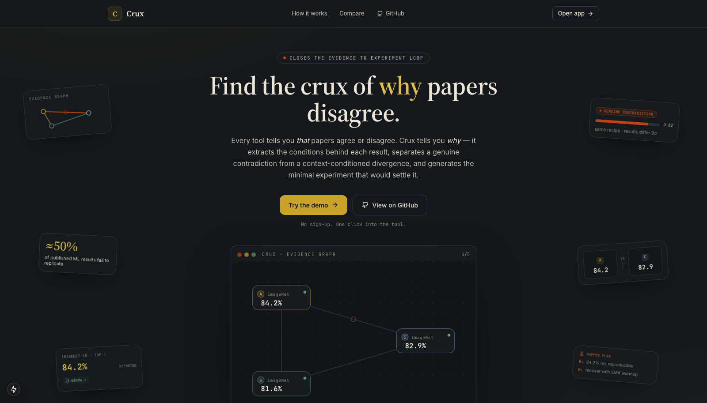
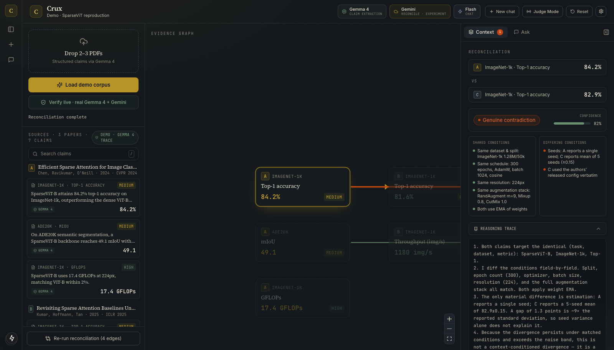
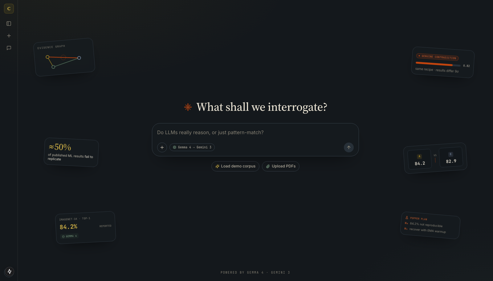
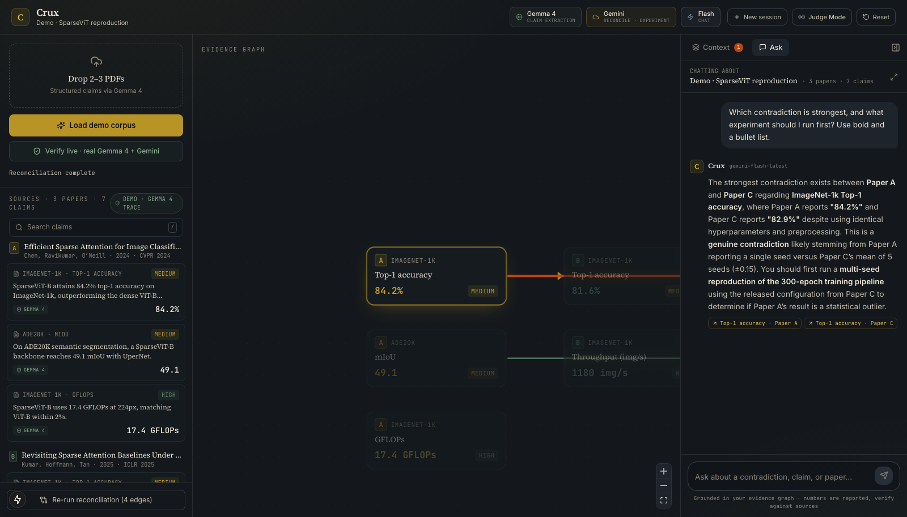
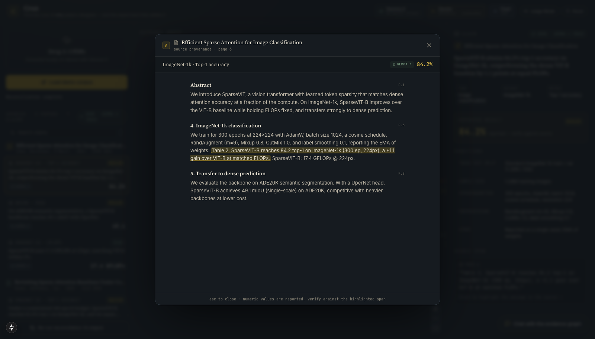
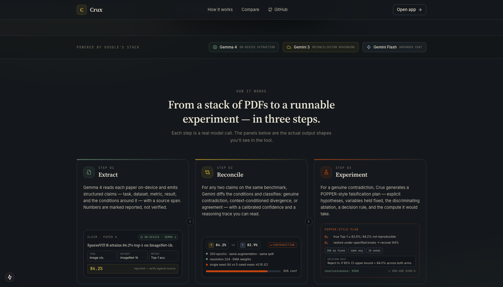
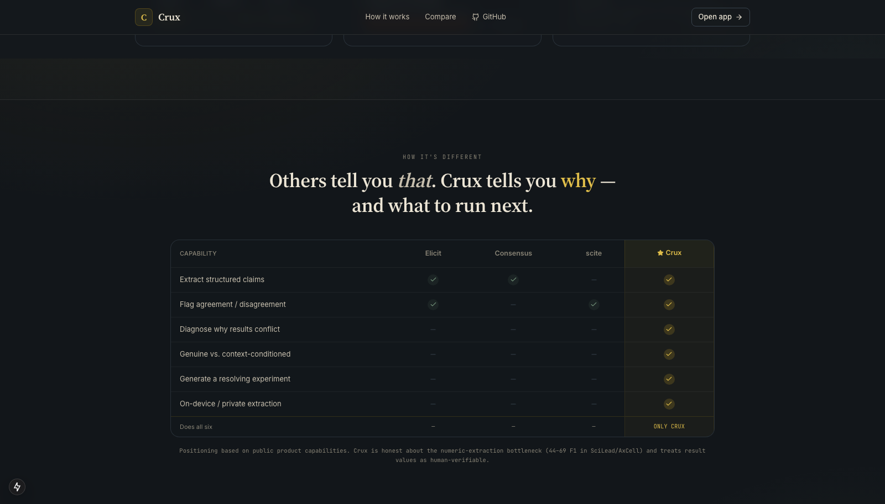

# Crux

### Find the crux of *why* papers disagree — and the experiment that settles it.

**Every existing tool tells you _that_ papers agree or disagree. Crux tells you _why_ — and generates the experiment that would settle it.**

An AI research assistant that ingests academic papers, extracts structured claims into a visual **evidence graph**, distinguishes genuine contradictions from *context-conditioned divergences*, and generates rigorous, POPPER-style falsification experiments to resolve them.

Built for the Google DeepMind Bangalore Hackathon on Google's stack: **Gemma 4** (on-device claim extraction), **Gemini 3 Flash** (reconciliation + experiment generation with a thinking budget), and **Gemini Flash** (grounded chat).



### The workspace — evidence graph, reconciliation, experiment

Load 2–3 papers, watch claims stream in, and the graph builds itself. Click a red edge to see *why* two papers conflict; click a tile to jump to the strongest one.



| Home (start a session) | Grounded chat | Source provenance |
|---|---|---|
|  |  |  |

| How it works | How it's different |
|---|---|
|  |  |

---

## The 60-second pitch

| | |
|---|---|
| **Problem** | ~50% of originally-significant scientific claims fail to replicate; systematic reviews take 12–18 months and can cost >US$300K. The painful core is *reconciliation*: a researcher finds two papers with opposite results and spends hours reconstructing whether they used the same split, metric, and hyperparameters. |
| **Prior art** | Elicit (extraction tables), Consensus (yes/no synthesis), scite.ai (citation context), PaperQA2 / **ContraCrow** (contradiction detection at scale — but *overconfident*, 60% human agreement). None diagnose *why* results conflict or emit an experiment. The 2026 **BioDivergence** benchmark formalizes exactly the "context-conditioned divergence" problem we target. **POPPER** (Stanford, ICML 2025) is our template for experiment rigor. |
| **Differentiator** | The **reconciliation-to-experiment bridge**: condition-aware diagnosis + minimal falsification experiment, with the privacy-sensitive extraction done **on-device with Gemma 4**. No shipping product closes this loop. |
| **Honesty** | Numeric result values are treated as **low-confidence, human-verifiable** fields with source-span provenance (LLMs hit only 44–69 F1 on result numbers per SciLead/AxCell). Reconciliation surfaces uncertainty and flags pairs for human review rather than over-asserting. |
| **Future work** | Code-repo + benchmark ingestion; SciFact/SciER quantitative eval; POPPER-style statistical error control (e-values); real-corpus retrieval via Semantic Scholar; confidence calibration learned from ContraCrow's failure mode. |

---

## Product surface

- **`/`** — landing page: hero with a live animated evidence-graph preview, the Extract → Reconcile → Experiment explainer, an Elicit/Consensus/scite comparison, and a "Try the demo" CTA that drops straight into the app (no sign-up).
- **`/app`** — the workspace: three-panel layout (sources · graph · detail) plus grounded chat.
- **`/app?demo=1`** — auto-runs the demo corpus. `&show=experiment` also opens the resolving experiment plan.
- **Judge Mode** — a header toggle that auto-plays the whole flow (extract → graph builds → contradiction surfaces → resolves → experiment appears) on an unattended ~90s loop, for a booth.
- **Keyboard** — `/` focuses claim search, `Esc` closes the detail panel / source viewer.

## Demo in under 3 minutes

The demo is **pre-baked and runs with zero configuration** — no API key required. Three ML papers all report **SparseViT on ImageNet-1k**, engineered to contain one genuine contradiction and one context-conditioned divergence:

- **Paper A** (CVPR'24): 84.2% top-1, 300 epochs, full augmentation, single seed.
- **Paper B** (ICLR'25): 81.6% top-1 — but only **100 epochs** with light augmentation.
- **Paper C** (TMLR reproducibility): 82.9% top-1 under the **exact same recipe as A**, mean of 5 seeds (±0.15).

→ **A vs C** = `GENUINE_CONTRADICTION` (same conditions, 1.3 pts ≈ 9σ apart).
→ **A vs B** and **B vs C** = `CONTEXT_CONDITIONED_DIVERGENCE` (training budget explains the gap).
→ **A vs C on ADE20K** = `AGREEMENT` (within noise).

### Scripted walkthrough

1. **Load.** Click **"Load demo corpus"** (or open `/?demo=1`). Watch claim cards stream in from the left — each tagged **"Extracted on-device · Gemma 4"** with a confidence pill. Result numbers show as *"reported — verify against source."*
2. **Graph.** The center evidence graph renders claim nodes per paper. As reconciliation runs (`Reconciling 1 of 4…`), edges animate and settle into color: **rust = contradiction, gold = divergence, sage = agreement.**
3. **Diagnose.** Click the **rust edge** between A and C. The right panel shows the verdict, a confidence bar, **shared vs differing conditions** side-by-side, and a collapsible **reasoning trace** ("…1.3 points is ~9× the reported standard deviation, so seed variance alone does not explain it…").
4. **Verify provenance.** Click a claim, then its **source span** → a reader opens the paper page with the exact passage highlighted and scrolled into view. Every number is labeled *reported*, not verified.
5. **Resolve.** Click **"Generate experiment to resolve."** A POPPER-style plan appears: explicit H₀/H₁, variables held fixed, the specific multi-seed ablation, the discriminating metric with a decision rule, expected outcomes for each side, conclusiveness, and compute cost.
6. **Chat.** Open **"Chat with the evidence graph"** and ask *"Show me the strongest contradiction"* — Gemini Flash answers grounded in the graph and auto-selects the edge.

> Deep-links for a hands-free replay: `/?demo=1` (auto-run) and `/?demo=1&show=experiment` (auto-open the experiment plan).

---

## Setup

```bash
git clone https://github.com/TeenTornado/crux.git
cd crux
npm install
cp .env.example .env.local     # optional — demo works without a key
npm run dev                    # http://localhost:3000
```

**Without a key:** full demo mode — pre-baked papers, curated reconciliations, and the POPPER experiment plan all work; uploaded PDFs fall back to the demo corpus, and an offline heuristic reconciler is available.

**With a `GEMINI_API_KEY`** (from [AI Studio](https://aistudio.google.com/apikey)): PDF uploads run **live** — the stronger **hosted Gemma 4 (31B)** extracts claims, Gemini reconciles each overlapping pair, and the experiment generator produces bespoke plans. The demo corpus stays curated so judging is deterministic.

> Extraction defaults to hosted Gemma 4 for quality. The **on-device** path (local Gemma via Ollama) is fully supported and still shown as a capability — uncomment `OLLAMA_HOST` in `.env.local` and the badge switches to "Extracted on-device", with no paper text leaving your machine.

### Model routing (`.env.local`)

| Tier | Env var | Default | Role |
|---|---|---|---|
| On-device extract | `GEMMA_MODEL` | `gemma-4-31b-it` | Structured claim extraction (JSON) |
| Orchestration | `GEMINI_RECONCILE_MODEL` | `gemini-3-flash-preview` | Condition-diff reconciliation (thinking) |
| Orchestration | `GEMINI_EXPERIMENT_MODEL` | `gemini-3-flash-preview` | POPPER-style experiment plans (thinking) |
| Low-latency | `GEMINI_CHAT_MODEL` | `gemini-flash-latest` | Grounded chat over the graph |

Each tier has a **fallback chain** so a quota-blocked or transiently-overloaded (5xx) preview model automatically degrades to the next model instead of failing.

### True on-device extraction (optional)

The extraction tier is designed to run **locally for privacy**. Point it at a local Gemma via [Ollama](https://ollama.com):

```bash
ollama pull gemma3
# in .env.local:
OLLAMA_HOST=http://127.0.0.1:11434
OLLAMA_GEMMA_MODEL=gemma3:latest
```

`/api/extract` then runs extraction entirely on your machine — no paper text leaves the device — and the UI badge switches to **"Extracted on-device · Gemma 4."**

---

## Architecture

```
┌──────────────────────────── Frontend (Next.js 15 · Tailwind · React Flow) ───────────────────────────┐
│  Sources (left)              Evidence graph (center)               Detail (right)                     │
│  • drag-drop PDFs            • claim nodes per paper                • claim provenance + source span   │
│  • streaming claim cards     • edges colored by verdict            • reconciliation: shared/differing  │
│  • on-device badge             (rust / gold / sage)                  conditions + reasoning trace      │
│  • reconcile progress        • animate on reconcile                • POPPER experiment plan            │
│                                                                                                        │
│  Chat dock — "chat with your evidence graph" (Gemini Flash, grounded)                                  │
└───────────────────────────────────────────────────────────────────────────────────────────────────────┘
        │ NDJSON stream                │ JSON                        │ JSON                  │ JSON
        ▼                              ▼                             ▼                       ▼
┌─────────────────┐        ┌──────────────────────┐     ┌────────────────────────┐  ┌──────────────────┐
│ /api/extract    │        │ /api/reconcile        │     │ /api/experiment        │  │ /api/chat        │
│ pypdf→section   │        │ diff CONDITIONS of    │     │ POPPER: H0/H1, held-   │  │ Flash, grounded  │
│ Gemma 4 → JSON  │        │ two claims →          │     │ fixed vars, ablation,  │  │ in the graph     │
│ (stream claims) │        │ verdict + reasoning   │     │ metric, decision rule  │  │                  │
└─────────────────┘        └──────────────────────┘     └────────────────────────┘  └──────────────────┘
   Gemma 4 (on-device          Gemini 3 Flash                Gemini 3 Flash              Gemini Flash
   or hosted)                  (thinking budget)             (thinking budget)

Graph construction: claims sharing (task, dataset, metric) across papers → candidate edges → reconcile.
Storage: in-memory (Zustand). Resets on refresh — by design for the demo.
```

### Pipeline (build order)

1. **PDF ingestion** (`src/lib/pdf.ts`) — `unpdf` with per-page text, section-priority slicing (abstract/results/tables), and page-provenance recovery for source spans.
2. **Claim extraction** (`src/lib/extractor.ts`, `/api/extract`) — Gemma 4 emits structured `(claim, task, dataset, metric, result, conditions, source_span)` JSON, streamed to the UI as NDJSON. Numeric results carry a confidence level.
3. **Graph construction** (`src/lib/graph.ts`) — claims grouped by normalized `(task, dataset, metric)`; cross-paper pairs become candidate edges.
4. **Reconciliation** (`src/lib/prompts.ts`, `/api/reconcile`) — Gemini diffs the *conditions* and returns `GENUINE_CONTRADICTION | CONTEXT_CONDITIONED_DIVERGENCE | AGREEMENT` with a calibrated confidence, shared/differing conditions, a step-by-step reasoning trace, and a `needs_human_review` flag.
5. **Experiment generation** (`/api/experiment`) — for a genuine contradiction, a POPPER-style plan with null/alternative hypotheses, variables held fixed, the discriminating ablation + decision rule, per-side expected outcomes, conclusiveness, and compute cost.
6. **Chat** (`/api/chat`) — Gemini Flash answers grounded strictly in the serialized graph.

---

## Project structure

```
src/
  app/
    page.tsx                 three-panel layout + demo deep-links
    layout.tsx, globals.css  editorial dark theme (ink / paper / rust / sage / gold)
    api/{extract,reconcile,experiment,chat}/route.ts
  components/
    Header, SourcesPanel, EvidenceGraph, ClaimNode, DetailPanel, ChatDock, ui
  lib/
    types, store (zustand), graph, prompts, gemini (REST client + fallback),
    extractor, pdf, heuristics (offline reconciler), demoData, theme, actions, client
```

---

## Honesty notes (for researcher-judges)

- **Numeric extraction is the known bottleneck.** We never assert result numbers as ground truth — every one is labeled *reported* with a confidence pill and a source span to verify (SciLead: 69.3 F1 GPT-4 / 44.0 Llama-3 on result values; AxCell F1 crashes 61.9 → 25.8 when the score is added).
- **Reconciliation is calibrated, not overconfident.** The prompt explicitly targets human-level agreement and flags under-specified pairs for review — a direct response to ContraCrow's 60.42% expert-agreement failure mode.
- **We generate plans, we don't run them.** Per the Sakana AI Scientist failure catalog (hallucinated results, ~half of experiments failing, data leakage), autonomous execution is out of scope; every plan is human-reviewable with explicit decision rules.

## Non-goals

Auth · persistent DB · full-corpus retrieval · autonomous experiment execution · perfect numeric extraction · multi-user collaboration.
